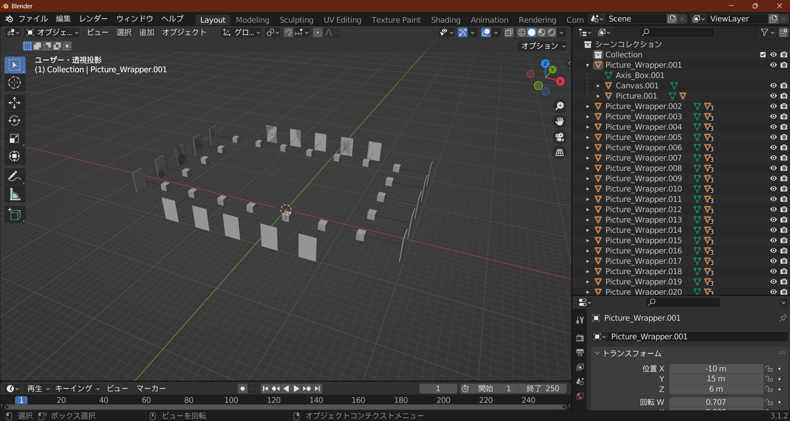
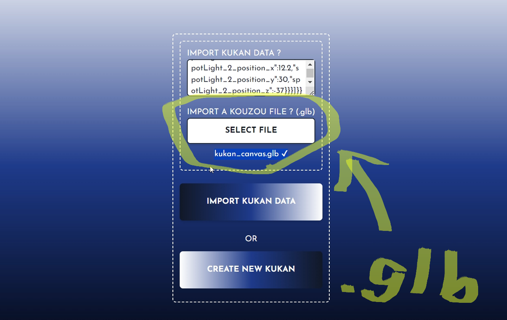

# MonacardKukan
## What is this?
・Kukan = "Space"
・Monacard Space
・You can create and share a space where Monacards are displayed.

## How to Use
1. First, go to "here" and arrange Monacards as you like.
2. Once you're done decorating, press the button to export the data.
3. Copy the exported data into the "kukan_data.json" file inside the "kukan_data" folder of MonacardKukan.
4. Upload all the MonacardKukan files to your own server, and you're done!

## Using Your Own 3D Model
You can display Monacards inside a custom 3D model (.glb format).

1. Extract the "kukan_canvas.glb" file from the "models" folder.
2. Open it in Blender or similar software and integrate it into your own 3D model. Do not rename any objects inside "kukan_canvas.glb"!
  
  
  
3. Export your 3D model in .glb format.
4. Import your 3D model via "here" and decorate it with Monacards as you like.
  
  
  
  
  
# MonacardKukan
## これは何？
・Kukan = 「空間」  
・もなかーど空間  
・モナカードを飾った空間を自分で公開できます  

## 使い方
1. まずは["コチラ"](https://monacardkukan.kotaroo.work)で自分の好きなようにモナカードを飾ります
2. 飾り終わったらボタンを押してデータを出力します
3. 出力したデータを MonacardKukan の "kukan_data "フォルダの中にある → "kukan_data.json" に貼り付けます。
4. MonacardKukan のファイルを全てそのまま自分のサーバーにアップロードして終わり

## 自作の3Dモデルに取り入れる
自分で作成した3Dモデル(.glb形式)の中でもモナカードが飾れます
1. 「models」フォルダの中にある「kukan_canvas.glb」ファイルを取り出します
2. Blender等のソフトで開き、自分で作成した3Dモデルに組み込みます。この時、取り込んだ「kukan_canvas.glb」内のオブジェクトの名前は変更しないで下さい！
  
  
  
3. 3Dモデルを「.glb」形式でエクスポートします
4. ["コチラ"](https://monacardkukan.kotaroo.work)から3Dモデルを取り込み、自分の好きなようにモナカードを飾ります
  
  
  
  
  
## License
MIT License.